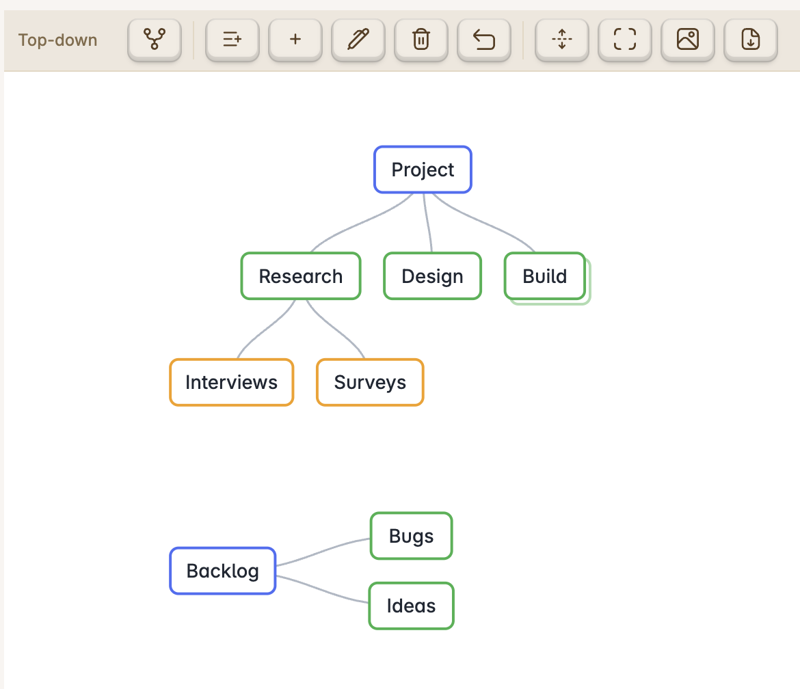

# OMM MindMap

An Obsidian plugin that renders any Markdown outline as an interactive mindmap, and turns a mindmap back into a clean Markdown bullet list.

## Features

- **Multiple trees per file** — every first-level bullet is its own tree, stacked top to bottom. Each tree has its own layout.
- **Two layouts** — top-down and left-right, toggled per tree from the toolbar. Layouts are stored as a per-tree list in front-matter (`mindmap-layout`).
- **View switching** — open a Markdown file as a mindmap, or jump back to the Markdown editor, without leaving the leaf.
- **Markdown is the source of truth** — the document is a nested bullet list plus a small front-matter block. Edits in either view stay in sync.
- **Interaction** — pan (drag), zoom (wheel), collapse/expand branches, select a node, and edit structure with the keyboard.
- **Space-efficient layout** — siblings and levels are packed by each node's actual size, so one wide node no longer spreads the whole tree apart. Node boxes size to their text, including full-width CJK characters.
- **Multi-line nodes** — a node can hold several lines; line breaks are stored in Markdown as `<br>`.
- **Links shown as labels** — `[[Folder/Note|Alias]]` renders as an underlined **Alias** (or the note's basename — never the full path); `[Label](url)` renders as **Label**. The raw Markdown is preserved for editing and storage.
- **Open links** — on a selected node, clicking again opens its link. Nodes with several links show a picker; internal notes open in a new tab, external URLs open in the browser.
- **Undo** — `Cmd/Ctrl+Z` (or the toolbar) reverts the last change (rename, add, delete, layout toggle).
- **Export** — save the current mindmap as **PNG** or **PDF** next to the note.
- **Desktop and mobile** — pan/zoom with touch, and edit structure from the toolbar buttons (no keyboard required).

### Mouse

| Action | Result |
| --- | --- |
| Click a node | Select it (shows its collapse/expand toggle) |
| Click a selected node | Open its link, if any (picker when there are several) |
| Double-click a node | Edit its text |
| Click the toggle (○) | Collapse / expand the node's children |
| Drag background | Pan · **wheel** zooms · click background to deselect |

A collapsed node is drawn with a faint "stacked card" behind it to signal hidden children. The collapse/expand toggle appears only on the selected node.

### Keyboard

| Key | Action |
| --- | --- |
| `Tab` / `Insert` | Add child to the selected node |
| `Enter` | Add a sibling after the selected node (a sibling of a root starts a new tree) |
| `Delete` / `Backspace` | Remove the selected node (deleting a root removes that whole tree) |
| `F2` / double-click | Edit the selected node |
| `Shift+Enter` | Insert a line break while editing (`Enter` commits) |
| `Cmd/Ctrl+Z` | Undo the last change |

## Document format

````markdown
---
mindmap-layout: [top-down, left-right]
---

- Project
  - Research
    - Interviews
    - Surveys
  - Design
  - Build
- Backlog
  - Bugs
  - Ideas
````

…renders as two trees — *Project* (top-down) and *Backlog* (left-right):



- **Each first-level bullet is a separate tree**, rendered top to bottom (the example above has two: *Project* and *Backlog*). There is no file-name root.
- `mindmap-layout` is a list with one style per tree, in order. If there are more trees than entries, the extra trees use the default (**left-right**). A bare value like `mindmap-layout: top-down` is accepted for a single tree.
- Toggling a tree's layout (toolbar) updates its entry in the list.
- Unknown front-matter keys are preserved on save.

## Usage

- Ribbon icon **Open as OMM mindmap**, the command **"Open current file as OMM mindmap"**, or the file's right-click menu.
- In the mindmap toolbar: toggle the **selected tree's** layout; **add child / add sibling / edit / delete** the selected node; **undo**; **expand all**; fit to view; export PNG/PDF; and **Open as Markdown**. The label shows the selected tree's layout.
- On mobile, tap a node to select it, then use the toolbar buttons to edit (no keyboard needed). Exports are written next to the note instead of downloaded.
- Set the default layout for new files in the plugin's settings tab.

## Development

```bash
npm install
npm run dev      # watch build → main.js
npm run build    # typecheck + production bundle
node test-model.mjs   # model tests (round-trip, links, display labels)
```

To try it in a vault, copy `main.js`, `manifest.json`, and `styles.css` into
`<vault>/.obsidian/plugins/obsidian-mindmap-omm/`, then enable the plugin in
Obsidian's Community Plugins settings.
